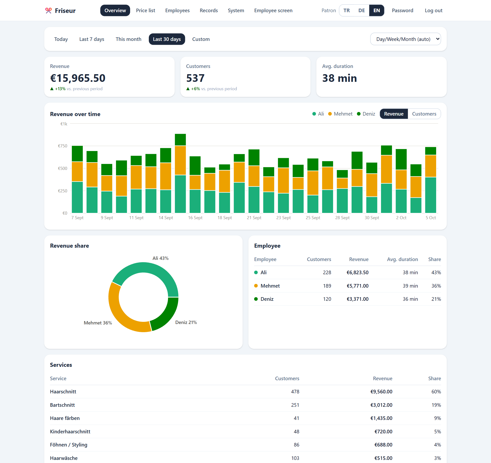
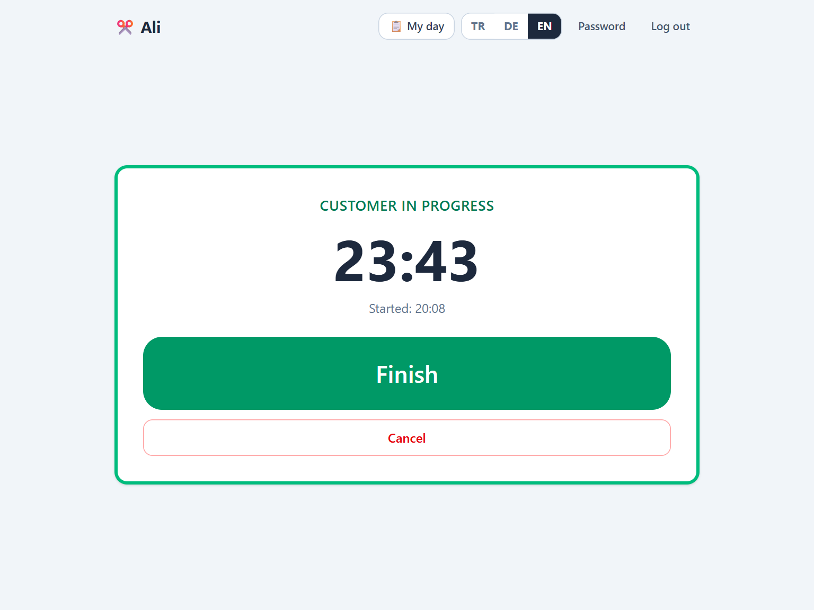
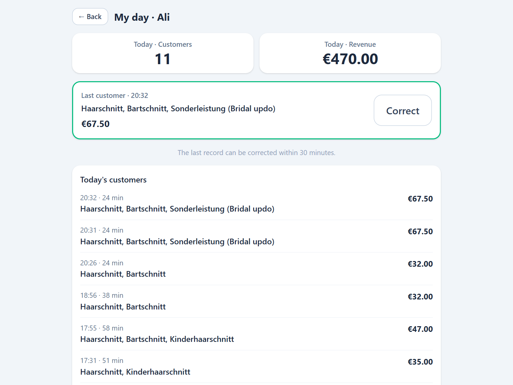
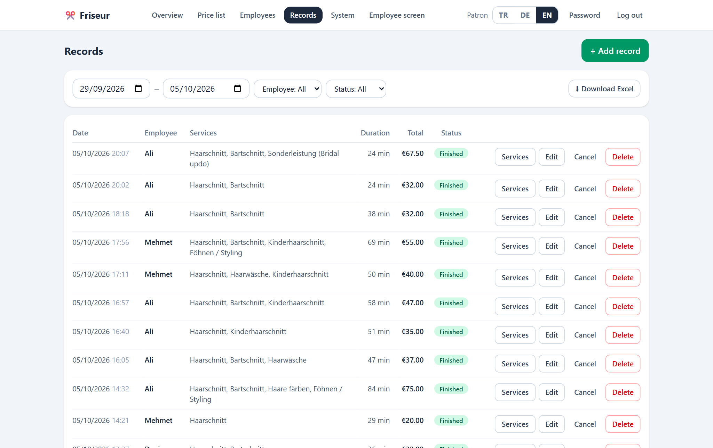
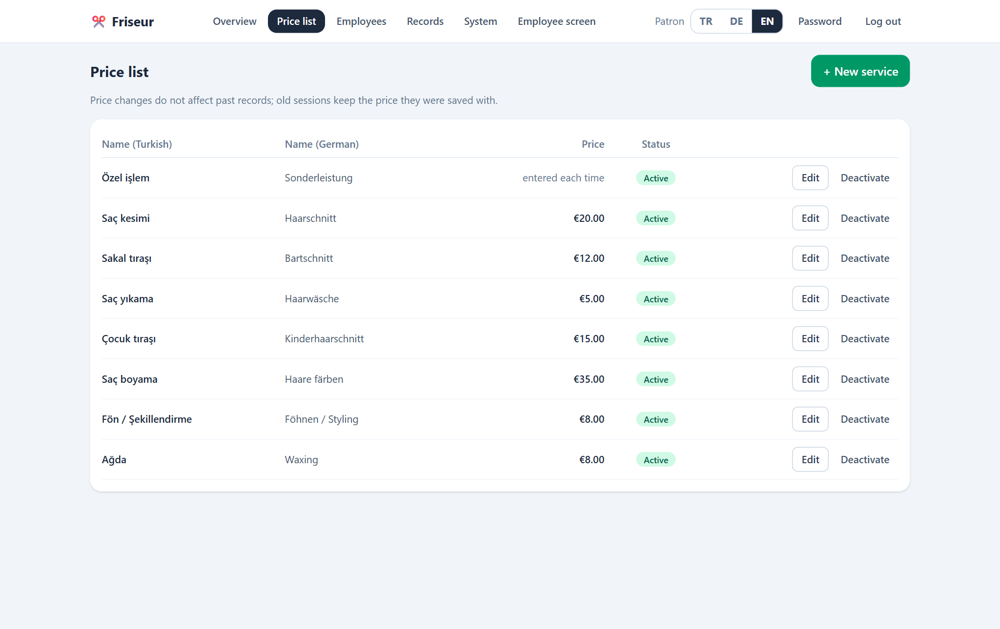

# Salon Tracker

[](https://github.com/AtakanUk/salon-tracker/actions/workflows/ci.yml)


[](LICENSE)

A tablet-first web app for a hair salon. Employees tap **Start** when a customer sits down and pick the services when they finish; the owner gets revenue, employee performance and the service mix on a dashboard. Built for a real salon in Germany and designed to be run by its owner, who is not technical: it backs itself up every night, mails when something is wrong, and has a one-command admin menu for everything else.

**Stack:** React 19 · TypeScript · Vite · Tailwind 4 · Recharts · Fastify 5 · Prisma 6 · PostgreSQL 17 · Docker Compose · Vitest



## Background

The owner wanted to see how many customers each employee serves, what each service earns and how that changes from month to month, without adding work at the chair. The requirements that shaped the design:

- **The tablet faces the customer.** The work screen only shows start and finish - no prices, no daily revenue. The employee's own day lives on a separate screen.
- **Two taps per customer.** Start when they sit down, pick services when they leave. Large touch targets, server-side timing.
- **History must not change.** Raising the price of a haircut must not rewrite last month's revenue.
- **Nobody from outside gets in.** Self-hosted on a small VPS, reachable only from the salon's devices over Tailscale, with no port open to the internet.
- **Mixed staff.** Turkish- and German-speaking employees, each with the interface in their own language.
- **The owner runs it alone.** Backups, alerts, recovery and account management without calling a developer.

## Features

**At the chair (tablet)**
- One big button: start → live timer → finish → pick services (multi-select, quantity) → save
- A custom service for work without a fixed price: the amount and a short note are typed in
- "My day": today's customers, revenue and records; the last record can be corrected or cancelled for 30 minutes
- Screen stays awake while a customer is in the chair (Wake Lock API); installs to the home screen as a PWA

**For the owner**
- Dashboard with date ranges, KPIs and change versus the previous period, revenue/customers per employee over time, revenue share and service breakdown
- Price list, employee accounts (create, deactivate, delete and restore, reset passwords), record management with filters, manual entries and an Excel export
- System page: health cards, one-click backup download, archive of a date range, restore from a backup file, retention cleanup that refuses to run without a fresh backup
- A warning banner on every admin page while something needs attention (disk, backups, database)

**Operations**
- Nightly backup at 03:00 salon time: `pg_dump`, Excel and a JSON export, mailed and kept on the server (60 days plus one per month)
- A watchdog that mails once when the app is down, the disk fills up or a backup is late, and once when it recovers
- `friseur` admin menu over SSH: status, restart, logs, backup, restore, password reset, update, cleanup
- Two publish modes: private over Tailscale (default) or public on a domain behind a shared password gate, switched with one line in `.env`
- Interface in Turkish, German and English, chosen per user

| Customer in the chair | Finishing | My day |
| --- | --- | --- |
|  |  |  |

| Records | Price list |
| --- | --- |
|  |  |

## Engineering highlights

- **Price snapshots.** Every line item stores the price at the moment the record was saved. Corrections keep the original snapshot for services already on the record and price newly added ones from today's list. A listed service is never priced from the request - only the custom service is, and that decision lives in exactly one function.
- **One open customer per employee, guaranteed by the database.** A partial unique index (`WHERE status = 'ACTIVE'`) backs up the API check, so a double tap on a slow tablet cannot create two sessions.
- **Statistics in the salon's time zone.** The server runs in UTC; days, weeks and months are cut at local midnight with plain `Intl`, including daylight saving changes. The tests pin both DST switches.
- **Rate limiting that survives a proxy.** With `trustProxy: true`, a client could forge `X-Forwarded-For` and get a fresh rate-limit bucket on every login attempt. `trustProxy: 1` trusts exactly the one proxy in front of the app; a test sends forged headers to prove it.
- **Soft delete that keeps history readable.** A deleted employee's username becomes `name#id`, so the name can be reused at once while past statistics still show the person who did the work. Restore refuses to take a username that has since been given away.
- **Restores that cannot do damage.** The JSON restore inserts only rows whose id is missing and then moves the sequences forward. Running it twice changes nothing - which is why it could become a button in the admin panel.
- **Security in the app, not in the proxy.** CSP, HSTS and the other headers come from the app, so both publish modes get them. The public mode's gate leaves a device cookie after basic auth; the Caddy config pins directive order so the cookie is never attached to a 401.
- **Backups you can trust.** Downloading a snapshot to a laptop checks that the dump opens on the server first, then compares the SHA-256 of every file.

More in [docs/architecture.md](docs/architecture.md): design decisions, data model, API reference, security notes and known trade-offs.

## Getting started

### Local development

Requires Node.js 24. No Docker needed: `npm run dev:db` starts a local PostgreSQL from an npm package.

```bash
npm install
cp server/.env.example server/.env

# terminal 1 - PostgreSQL on :5433 (sets itself up on first run)
npm run dev:db

# terminal 2 - once: schema + 60 days of demo data
cd server
npx prisma migrate deploy
SEED_DEMO=1 npx tsx src/seed.ts      # prints the generated passwords once
cd ..

# terminal 2 - API on :3001 and the web app on :5173
npm run dev
```

Open <http://localhost:5173> and sign in as `admin` (owner) or `ali` (employee) with the passwords the seed printed. There are no default passwords; `npm run reset-password -w server` sets a new one. In the demo data, haircuts older than 30 days cost €2 less - the price snapshots at work.

### Docker

```bash
cp .env.example .env                  # set DB_PASSWORD and JWT_SECRET
docker compose up -d --build
docker compose exec -e SEED_DEMO=1 app node server/dist/seed.js
```

The app listens on <http://localhost:3001>. For a real server with Tailscale, mail, the watchdog and the optional public mode, see [docs/deployment.md](docs/deployment.md).

## Tests

```bash
npm run dev:db    # in another terminal; tests use a separate friseur_test database
npm test
```

The suite runs against a real PostgreSQL with the real migrations (Vitest + Fastify's `inject`). It covers price snapshots and corrections, the custom service, the one-open-session index, the correction window, role checks, login rate limiting behind a proxy, soft delete and restore, statistics bucketing across midnight and DST, and the JSON backup round trip. CI runs the type checks, both builds and the tests against a PostgreSQL 17 service on every push.

Set `TEST_DATABASE_URL` to use another server; the database name has to end in `_test`, because every test starts by truncating the tables.

## Project structure

```text
server/
  prisma/              schema + migrations (incl. the hand-written partial unique index)
  src/routes/          auth, users, services, sessions, stats, system, exports
  src/backup/          nightly job, Excel and JSON export, restore, scheduler
  src/tools/           CLI tools used by the admin menu (backup, restore, password reset)
  src/lib/             time zone helpers, serialization, mailer, errors
  test/                Vitest suites (unit + API against PostgreSQL)
  scripts/dev-db.ts    local PostgreSQL without Docker
web/
  src/pages/           Work (tablet), MyDay, Login, admin/*
  src/components/      service picker, health banner, UI kit
  src/i18n/            tr.json, de.json, en.json
ops/                   admin menu, watchdog, server setup, Caddyfile, snapshot scripts
docs/                  architecture, deployment, operator guide, screenshots
```

## Documentation

- [Architecture](docs/architecture.md) - decisions, data model, API, security
- [Deployment](docs/deployment.md) - VPS + Tailscale, public mode, backups, updates
- [Operator guide](docs/operator-guide.md) - the salon owner's one-page manual

## License

[MIT](LICENSE)
