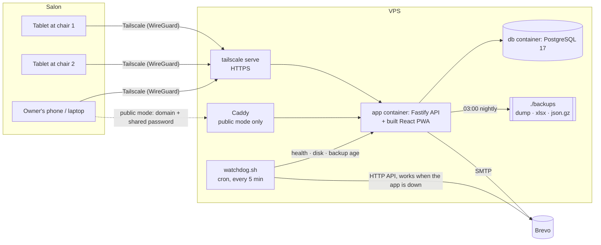
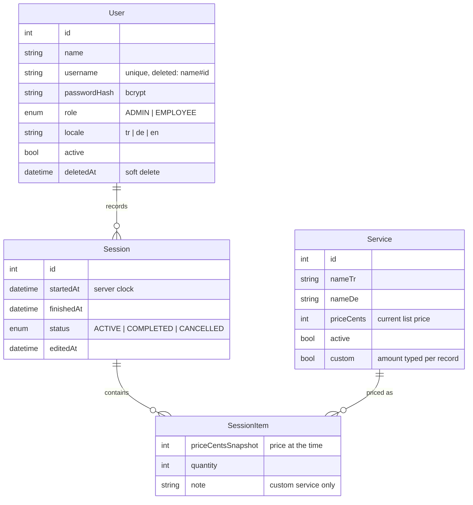

# Architecture

## Overview



One container serves both the API (`/api/*`) and the compiled web app; every other `GET`
falls back to `index.html`. The request path is `browser → Fastify → Prisma → PostgreSQL`.

## Design decisions

| Decision | Why |
|---|---|
| **PWA, not a native app** | Runs on iPad and Android from one codebase, no store review, updates land instantly. "Add to home screen" makes it feel like an app. |
| **Self-hosted, private by default** | The owners did not want their business data at a third party or reachable from the internet. Tailscale gives HTTPS and access control without opening a single port. |
| **Second publish mode as a compose override** | For setups without a VPN: `docker-compose.public.yml` adds Caddy (Let's Encrypt + a shared password gate). The `app` and `db` services are identical in both modes; one `.env` line switches. |
| **Security inside the app, not in the proxy** | Helmet (CSP, HSTS, nosniff, frame-ancestors), rate limiting and `trustProxy` live in `server/src/app.ts`. Had they been in Caddy, the private mode would have had none of them. |
| **No default passwords** | The seed generates them and prints them once. The admin gets 16 random characters; employees get a readable `word-1234` because they type it on a tablet every morning. |
| **Prices snapshotted on every record** | `SessionItem.priceCentsSnapshot` is written when a session is finished. Changing the price list never rewrites history: a €20 haircut from last month stays €20. |
| **Money in integer cents** | No floating-point rounding anywhere; formatting with `Intl.NumberFormat`. |
| **Services are deactivated, never deleted** | Old records keep a valid reference and a name. |
| **Server time only** | `startedAt`/`finishedAt` are set by the server. Tablet clocks drift and can be changed. |
| **One open customer per employee, enforced by the database** | A partial unique index (below) in addition to the API check, so a double tap cannot race past it. |
| **30-minute correction window** | An employee can correct or cancel their last record for 30 minutes; after that only the owner can. Fixes typos, prevents quiet edits later. |
| **Soft delete for accounts** | Statistics and exports read the employee's name through the session relation, so a deleted employee still appears with their name and revenue in past periods. |
| **Statistics grouped in the salon's time zone** | The server runs in UTC; days, weeks and months are cut at local midnight in `SALON_TZ`, including DST changes. Plain `Intl`, no date library. |
| **Three languages** | Turkish and German are the salon's languages (per-user setting); English was added for this public version. The price list itself is kept in Turkish and German. |

## Data model



The constraint Prisma's schema language cannot express lives in the first migration:

```sql
CREATE UNIQUE INDEX "Session_one_active_per_employee"
ON "Session"("employeeId") WHERE "status" = 'ACTIVE';
```

A few rules worth knowing:

- **Finishing** copies each service's current price into `priceCentsSnapshot`.
- **Correcting** a record keeps the snapshot of services that were already on it;
  services added during the correction are priced from today's list.
- **The custom service** ("Özel işlem" / "Sonderleistung") is the one item whose amount
  comes from the request. A listed service is never priced from the request, otherwise an
  employee could name their own price. The decision is made in exactly one place,
  `itemRow()` in `server/src/routes/sessions.ts`.
- **Cancelled** records are kept, but excluded from every statistic.
- **Deleting an account** renames `username` to `name#id`. `#` is not allowed in
  usernames, so it can never clash with a live account and the old name is free for a new
  one. The UI shows the part before `#`.

## API

All endpoints are under `/api`. Authentication is a JWT in an httpOnly cookie (60 days, so
tablets stay signed in). 🔓 public · 👤 signed in · 👑 owner only.

| Endpoint | Who | What |
|---|---|---|
| `GET /health` | 🔓 | used by the watchdog |
| `POST /auth/login` | 🔓 | 20 attempts/min per client IP |
| `POST /auth/logout` · `GET /auth/me` · `PATCH /auth/me/locale` · `PATCH /auth/me/password` | 👤 | |
| `GET /sessions/board` | 👤 | everything the tablet needs in one call: open customer, today's list and totals, whether the last record is still correctable, server time |
| `POST /sessions/start` | 👤 | `409 active_session_exists` |
| `POST /sessions/:id/finish` | 👤 | `{ items: [{ serviceId, quantity, priceCents?, note? }] }` - prices are snapshotted here |
| `POST /sessions/:id/cancel` · `PATCH /sessions/:id/items` | 👤 / 👑 | employees: own records, 30-minute window |
| `GET /sessions` · `POST /sessions` · `PATCH /sessions/:id` · `DELETE /sessions/:id` | 👑 | browse with filters, add a missed record, fix times, delete |
| `GET /services` · `POST /services` · `PATCH /services/:id` | 👤 / 👑 | |
| `GET /users` · `POST /users` · `PATCH /users/:id` · `DELETE /users/:id` · `POST /users/:id/restore` | 👑 | soft delete and restore; you cannot delete, deactivate or demote yourself |
| `GET /users/:id/impact` · `DELETE /users/:id/permanent` | 👑 | permanent delete, only for accounts that are already soft-deleted |
| `GET /stats/overview` · `GET /stats/timeseries` | 👑 | `?from&to` (salon-local dates), `granularity=day\|week\|month` |
| `GET /system/status` · `POST /system/backup` · `POST /system/test-mail` | 👑 | health, disk, last backup, recent errors |
| `GET /system/backup/latest.zip` · `GET /system/backup/file/:name` | 👑 | downloads; file names are validated against a strict pattern |
| `GET /system/archive/preview` · `GET /system/archive.zip` | 👑 | export of a date range, streamed, never written to disk |
| `POST /system/restore` | 👑 | raw `.json.gz` body; inserts only rows whose id is missing |
| `GET /system/cleanup/preview` · `POST /system/cleanup` | 👑 | delete old records; refused without a backup from the last 15 minutes |
| `GET /export/sessions.xlsx` | 👑 | Excel export of a date range |

Errors are `{ "error": "<code>" }`; the web app maps each code to a translated message.

## Security notes

- **Rate limiting behind a proxy.** `trustProxy: 1` means "exactly one proxy in front of
  me", so `req.ip` is the address that proxy appended. With `trustProxy: true` a client
  could put any address into `X-Forwarded-For` and get a fresh rate-limit bucket on every
  login attempt. This was measured against a real proxy chain before going live and is
  covered by a test.
- **CSP without exceptions for scripts.** `script-src 'self'`; the PWA's service worker
  registration is an external file, not an inline script.
- **The shared password gate** (public mode) stores a 2-year cookie after a successful
  basic-auth check. The Caddy `route` block is required: in Caddy's default directive
  order `header` runs before `basic_auth`, so the `Set-Cookie` would also be attached to
  the 401 response and anyone could walk in on their second request. The cookie match is
  anchored for the same reason.
- **Revoking a device** means rotating the cookie value, not the password.
- **Downloads** only serve file names produced by the backup job (strict regex); path
  traversal attempts get 400/404.
- **Backups** contain bcrypt hashes (so a restored account keeps its password); they are
  not reversible, but backup files should still be kept somewhere private.

## Operations

- **Nightly backup** (03:00 salon time, scheduled inside the app): `pg_dump`, a 4-sheet
  Excel file and a gzipped JSON export, mailed as attachments. 60 days are kept, plus the
  oldest file of every month for good. If the server was off at 03:00, a catch-up backup
  runs after start.
- **JSON restore** compares a backup with the live database by id and only inserts what
  is missing, then moves the sequences past the restored ids. It is safe to run twice,
  which is what made it safe to expose as a button in the admin panel.
- **Watchdog** (host cron): app health, disk usage, backup age. It mails once when a check
  fails and once when it recovers, through the Brevo HTTP API, so it does not depend on
  the app being alive.
- **Admin menu** (`friseur`): status, restart, logs, backup, full restore with a safety
  copy first, JSON import, password reset, update, cleanup.
- **Snapshots to a laptop** (`ops/pull-snapshot.ps1`): verifies the dump on the server
  before downloading, then compares the SHA-256 of every file after the download.
- **Logs** are rotated by Docker (10 MB × 7 per service). `restart: unless-stopped` brings
  everything back after a crash or a reboot.

## Known trade-offs

- The container runs as root. Switching to `USER node` also means changing the ownership
  of the mounted `backups/` folder; done wrong, the nightly backup fails silently, so it
  is left as a separate change.
- Changing your own password does not sign out your other devices (no password version in
  the JWT). Deactivating an account does.
- There is no per-username lockout, only the per-IP rate limit (plus the gate in public
  mode).
- The web bundle is about 740 KB, mostly Recharts. Lazy-loading the admin pages would
  halve the tablet's first load.
- Recharts is kept on v2 on purpose; the v3 migration has not been done.
